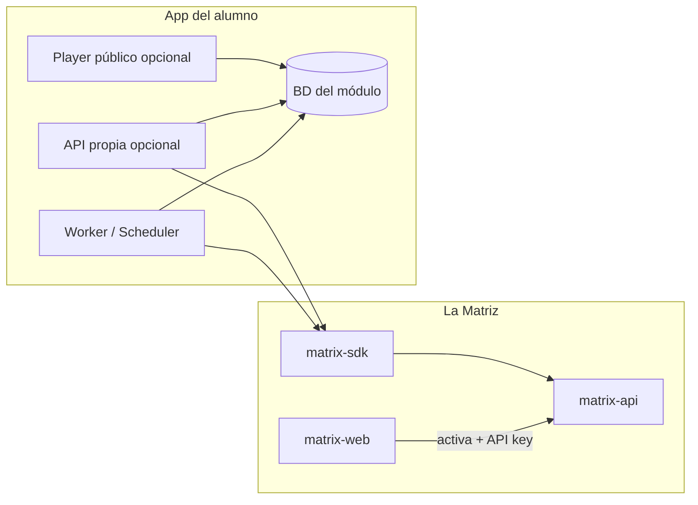

# 02 — Anatomía de un módulo

Un módulo alumno **no es** un parche dentro de `matrix-api`. Es una aplicación separada que consume La Matriz como servicio central.

## Diagrama



## Componentes

### Worker / Scheduler

Proceso que se ejecuta en intervalo (cron, `node scheduler.ts`, Laravel `schedule:run`):

- Comprobaciones periódicas (web, menciones, reseñas).
- Generación programada (artículos SEO).
- Reintentos y colas internas.

**Referencia:** `apps/module-web-uptime/src/check.ts` + `scheduler.ts`.

### API propia (recomendada en módulos medios/altos)

Servidor HTTP que expone:

- Webhooks entrantes (Meta WhatsApp, Google).
- Panel de administración del módulo.
- OAuth callbacks.
- Endpoints de aprobación (SEO, reseñas negativas).

Stack libre: **Express/Fastify (Node)** o **Laravel** en `apps/module-{slug}/`.

### Base de datos del módulo

MySQL/Postgres **propia** del módulo. Ejemplos de datos que **no** van en La Matriz:

- Historial de caídas web (`incidents`).
- Borradores y aprobaciones SEO.
- Documentos PDF para WhatsApp Guardia.
- Pantallas, playlists, menú, vídeos.

La Matriz solo guarda: org, negocio, suscripciones, leads, alertas, conexiones cifradas, token budget.

### Player público (módulos visuales)

URL tipo `https://tu-modulo.example/play/{screenToken}` abierta en un navegador/TV. Sin login de La Matriz; autenticación por token opaco de pantalla.

## Estructura de carpetas sugerida

```
apps/module-{slug}/
  package.json
  .env.example
  src/
    index.ts          # entry worker
    scheduler.ts
    lib/
      matrix.ts       # cliente SDK configurado
    api/              # opcional: Express routes
    db/
      migrations/
  README.md           # cómo arrancar TU módulo
```

Para Laravel:

```
apps/module-{slug}/
  artisan
  app/
  database/migrations/
  routes/api.php      # webhooks + panel
```

## Flujo de arranque típico

```typescript
// 1. Validar suscripción
await matrix.subscriptions.check('mi-slug');

// 2. Cargar contexto del negocio
const ctx = await matrix.auth.check();
const settings = ctx.settings ?? {};

// 3. Ejecutar lógica del módulo (con tu BD local)
```

## Lo que NO debes hacer

| Prohibido | Motivo |
|-----------|--------|
| `mysql` directo a BD de `matrix-api` | Rompe multitenancy y seguridad |
| Hardcodear `organization_id` / `business_id` | El SDK ya los fija por API key |
| Guardar API keys de Google/Meta en tu `.env` del módulo | Usa Provider Connections |
| Publicar contenido crítico sin aprobación humana | Requisito de negocio (GMB, SEO) |

## Multitenancy en tu BD

Todas las tablas del módulo deben incluir al menos:

```sql
organization_id BIGINT NOT NULL,
business_id BIGINT NOT NULL,
```

Obtén esos IDs de `matrix.auth.check()` al inicio de cada job y filtra **siempre** por ellos.

## Siguiente paso

[03 — Contrato con La Matriz](03-contrato-matriz.md)
