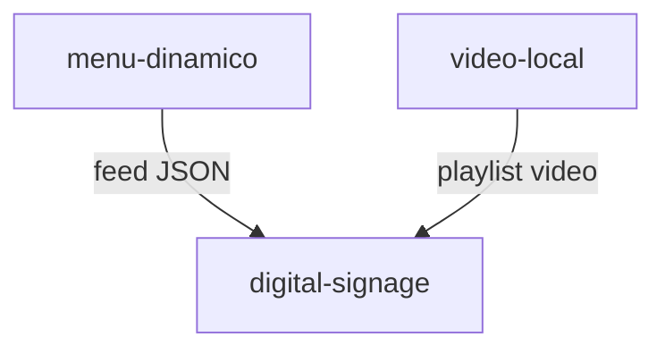

# Documentación para alumnos — módulos BusyManager

Guía para desarrollar apps que se integran con **La Matriz** sin tocar su base de datos. Cada módulo es una app independiente en `apps/module-{slug}/`.

**Repositorio:** https://github.com/walperezdev/busymanager

## Orden de lectura recomendado

0. **[00 — Inicio rápido (primer día)](00-inicio-rapido.md)** ← si empiezas mañana
1. [01 — Entorno y activación](01-entorno-y-activacion.md)
2. [02 — Anatomía de un módulo](02-anatomia-de-un-modulo.md)
3. [03 — Contrato con La Matriz (SDK)](03-contrato-matriz.md)
4. [04 — Settings y configuración](04-settings-y-config.md)
5. [05 — Panel y experiencia de usuario](05-panel-y-ux.md)
6. [06 — Guía de estilos](06-guia-estilos.md) — paneles y colas de aprobación
7. **Tu app** → [apps/](apps/) (qué entregar) y [modules/](modules/) (ficha técnica)
8. [Cómo crear tu carpeta de módulo](crear-una-app.md)
9. Antes de entregar → [checklist de entrega](appendices/checklist-entrega.md)

## Apps del curso

El profesor asigna la app; las instrucciones van **por slug**, no por persona.

→ **[Índice de apps](apps/README.md)**  
→ **[Mensajes para enviar a alumnos](mensajes-para-alumnos.md)** (emails listos)  
→ **[Crear una app](crear-una-app.md)** (paso a paso técnico)

## Módulos disponibles en este curso

| # | Módulo | Slug | Dificultad | Doc |
|---|--------|------|------------|-----|
| 11 | Monitor web y SSL | `web-uptime` | Intro | [web-uptime](modules/web-uptime.md) |
| 3 | Reseñas GMB | `resenas-gmb` | Media | [resenas-gmb](modules/resenas-gmb.md) |
| 4 | WhatsApp Guardia | `whatsapp-guardia` | Media-alta | [whatsapp-guardia](modules/whatsapp-guardia.md) |
| 5 | Voz a gestión | `voz-gestion` | Media-alta | [voz-gestion](modules/voz-gestion.md) |
| 6 | SEO Pipeline | `seo-pipeline` | Alta | [seo-pipeline](modules/seo-pipeline.md) |
| 19 | Monitor de menciones | `monitor-menciones` | Media | [monitor-menciones](modules/monitor-menciones.md) |
| 20 | Digital Signage | `digital-signage` | Alta | [digital-signage](modules/digital-signage.md) |
| 22 | Menú dinámico | `menu-dinamico` | Media-alta | [menu-dinamico](modules/menu-dinamico.md) |
| 21 | Video en local | `video-local` | Media | [video-local](modules/video-local.md) |

**Recomendación:** empieza por **web-uptime** (referencia implementada en `apps/module-web-uptime`).

### Slugs absorbidos (no desarrollar como apps separadas)

| Slug retirado | Incluido en |
|---------------|-------------|
| `monitor-ssl` | `web-uptime` |
| `seo-onpage` | `seo-pipeline` |
| `alerta-posicion-seo` | `enlaces-rotos` |

## Módulos visuales relacionados

`menu-dinamico` y `video-local` pueden integrarse con `digital-signage`, pero deben funcionar de forma autónoma.

## Apéndices

- [Provider Connections](appendices/provider-connections.md)
- [Catálogo de eventos webhook](appendices/eventos-webhook.md)
- [Checklist de entrega](appendices/checklist-entrega.md)

## Reglas inmutables

1. **Nunca** conectes a la base de datos de La Matriz.
2. Usa siempre `@busymanager/matrix-sdk`.
3. El `organization_id` y `business_id` vienen de la API key; no los sobrescribas.
4. Credenciales de terceros solo vía `matrix.connections.get()`.
5. IA solo tras `matrix.tokens.check()` + `matrix.tokens.consume()`.

## Referencias del repo

- Arquitectura: [docs/architecture.md](../architecture.md)
- Guía rápida: [docs/module-guide.md](../module-guide.md)
- Validación E2E: [scripts/e2e-validation.md](../../scripts/e2e-validation.md)
- SDK: [packages/matrix-sdk](../../packages/matrix-sdk)
