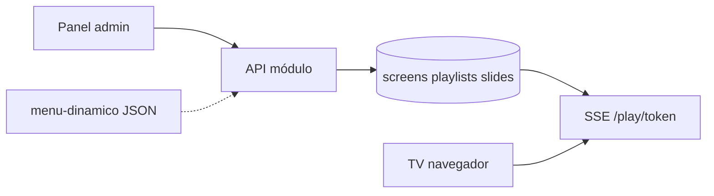

# Módulo: Digital Signage (`digital-signage`)

## Resumen y valor PYME

Gestiona el contenido de las pantallas del local: menús, ofertas, avisos, precios, promociones. El responsable actualiza desde móvil o panel y los cambios se reflejan en las pantallas en **tiempo real**. Funciona en cualquier pantalla con navegador; no requiere hardware propietario.

**Categoría:** visual  
**Nota:** En el seed del catálogo aparece `is_available: false` — proyecto avanzado, pero la especificación es completa.

## Requisitos funcionales

1. CRUD de pantallas (`screens`) con token de reproducción único.
2. CRUD de playlists y slides (imagen, vídeo, HTML, duración).
3. Player full-screen: `/play/{screenToken}`.
4. Actualización en tiempo real al guardar (SSE recomendado en MVP).
5. Asignar playlist activa por pantalla.

## Reglas de seguridad / negocio

> El `screenToken` debe ser largo y aleatorio (≥ 32 bytes hex); no uses IDs secuenciales en la URL pública.  
> No cargues HTML arbitrario de usuarios sin sanitizar (riesgo XSS en el local).  
> Contenido subido: validar MIME y tamaño máximo.

## Slug y dependencias

| Campo | Valor |
|-------|--------|
| Slug | `digital-signage` |
| Providers | ninguno obligatorio en MVP |
| Integración opcional | [menu-dinamico](menu-dinamico.md) (playlist tipo `menu_feed`) |

## Diagrama de flujo



## Modelo de datos sugerido

### `screens`

| Campo | Tipo |
|-------|------|
| id | PK |
| organization_id, business_id | bigint |
| name | string |
| screen_token | string unique |
| active_playlist_id | FK nullable |
| last_seen_at | datetime nullable |

### `playlists`

| Campo | Tipo |
|-------|------|
| id | PK |
| business_id | bigint |
| name | string |
| type | enum: standard, menu_feed, video_feed |

### `slides`

| Campo | Tipo |
|-------|------|
| id | PK |
| playlist_id | FK |
| sort_order | int |
| kind | enum: image, video, html, menu_json |
| payload | json |
| duration_seconds | int |

## Settings

**`settings.modules.digital-signage`:**

```json
{
  "default_slide_duration": 10,
  "transition": "fade",
  "timezone": "Europe/Madrid"
}
```

## Integración SDK

| Método | Uso |
|--------|-----|
| `subscriptions.check('digital-signage')` | Health check del servicio |
| `auth.check()` | `business_id` al crear pantallas desde worker |
| `webhooks.emit('playlist.updated')` | Opcional al guardar |

La mayoría de operaciones son locales en tu API; el SDK solo valida que el negocio tiene el módulo activo en endpoints admin protegidos por API key o sesión.

## Player (MVP)

- Página estática que abre `EventSource('/api/screens/{token}/stream')`.
- Al evento `playlist_updated`, recarga JSON de slides y re-renderiza.
- Modo kiosk: CSS `100vh`, sin scroll, cursor oculto opcional.

## Fases de entrega

### MVP

- [ ] 1 pantalla, 1 playlist, 3 slides imagen
- [ ] Player en navegador con token
- [ ] SSE notifica cambio al guardar en admin

### Completo

- [ ] Vídeo HTML5 + HTML sanitizado
- [ ] Multi-pantalla por negocio
- [ ] Integración feed menú dinámico
- [ ] `last_seen_at` heartbeat del player

## Criterios de aceptación

- [ ] Cambiar slide en panel → player actualiza en < 5 s sin recargar manual F5.
- [ ] Token inválido → 404 en player.
- [ ] Dos negocios no comparten playlists.

## Referencias

- [menu-dinamico](menu-dinamico.md)
- [video-local](video-local.md)
- [05-panel-y-ux](../05-panel-y-ux.md)
