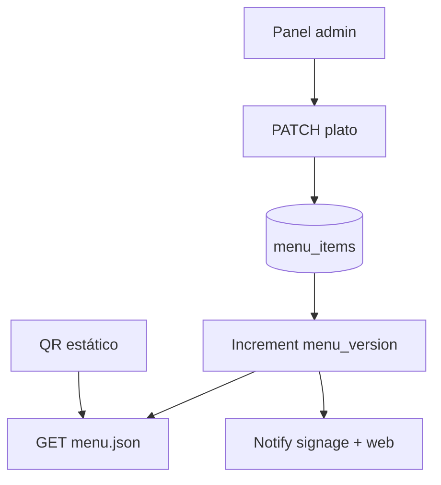

# Módulo: Menú dinámico (`menu-dinamico`)

## Resumen y valor PYME

La carta del restaurante o cafetería se gestiona desde el panel y se actualiza en tiempo real en **pantallas**, **código QR** y **web** a la vez. Un cambio de precio, baja por agotamiento u oferta especial se aplica en todos los canales sin tocar WordPress ni otros sistemas.

**Categoría:** visual

## Requisitos funcionales

1. CRUD de categorías y platos (nombre, descripción, precio, alérgenos opcional).
2. Flags: `available`, `featured`, `offer_price` opcional.
3. API pública versionada: `GET /api/menu/{businessSlug}/v1.json`.
4. Al mutar menú: invalidar cache / notificar SSE a signage y web embed.
5. Página QR que apunta a menú móvil responsive.

## Reglas de seguridad / negocio

> La API pública solo expone datos de menú, nunca credenciales.  
> Precios con IVA según configuración del negocio (`settings.modules.menu-dinamico.prices_include_vat`).  
> Historial de precios opcional para auditoría interna.

## Slug y dependencias

| Campo | Valor |
|-------|--------|
| Slug | `menu-dinamico` |
| Integración | [digital-signage](digital-signage.md) (playlist `menu_feed`) |
| Providers | ninguno obligatorio |

## Diagrama de flujo



## Modelo de datos sugerido

### `menu_categories`

| Campo | Tipo |
|-------|------|
| id | PK |
| business_id | bigint |
| name | string |
| sort_order | int |

### `menu_items`

| Campo | Tipo |
|-------|------|
| id | PK |
| category_id | FK |
| name | string |
| description | text |
| price_cents | int |
| offer_price_cents | int nullable |
| available | bool |
| featured | bool |
| allergens | json array |
| updated_at | datetime |

### `menu_meta`

| Campo | Tipo |
|-------|------|
| business_id | PK |
| version | int |
| published_at | datetime |

## Settings

**`settings.modules.menu-dinamico`:**

```json
{
  "currency": "EUR",
  "prices_include_vat": true,
  "public_slug": "karting-valencia-cafe",
  "qr_base_url": "https://menu.tudominio.com"
}
```

## Formato JSON público (ejemplo)

```json
{
  "version": 42,
  "currency": "EUR",
  "categories": [
    {
      "name": "Bebidas",
      "items": [
        { "name": "Café", "price": 1.5, "available": true, "featured": false }
      ]
    }
  ]
}
```

## Integración SDK

| Método | Uso |
|--------|-----|
| `subscriptions.check('menu-dinamico')` | En API admin |
| `auth.check()` | `business_id` al importar seed |
| `webhooks.emit('menu.updated')` | Tras publicar versión |

## Fases de entrega

### MVP

- [ ] 2 categorías, 5 platos
- [ ] PATCH desactiva plato → `available: false` en JSON
- [ ] Página QR estática leyendo JSON

### Completo

- [ ] SSE a digital-signage
- [ ] Ofertas y platos destacados
- [ ] Embed script para web del cliente (`<script src=".../embed.js">`)

## Criterios de aceptación

- [ ] Cambiar precio → `version` incrementa; clientes con ETag reciben 200 nuevo cuerpo.
- [ ] Plato agotado no aparece en canal «solo disponibles» si query `?available=1`.
- [ ] Funciona sin WordPress conectado.

## Referencias

- [digital-signage](digital-signage.md)
- [eventos-webhook.md](../appendices/eventos-webhook.md)
