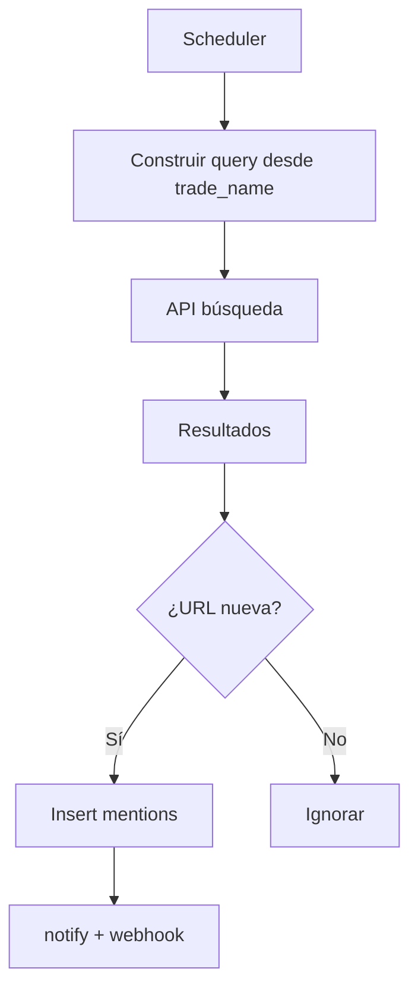

# Módulo: Monitor de menciones (`monitor-menciones`)

## Resumen y valor PYME

Rastrea cuándo aparece el nombre del negocio en Google, noticias o redes. Al detectar una mención nueva, envía alerta al responsable con enlace y contexto para reaccionar a tiempo a menciones positivas o negativas.

**Categoría:** social

## Requisitos funcionales

1. Definir query de búsqueda a partir del nombre comercial del negocio.
2. Ejecutar búsqueda periódica (polling cada 1–6 h según plan).
3. Deduplicar por URL o id externo.
4. Guardar mención con snippet, fuente, fecha.
5. Alertar vía `notify` + webhook `mention.detected`.

## Reglas de seguridad / negocio

> Respeta términos de uso y cuotas de las APIs de búsqueda (Google Custom Search, News API, etc.).  
> No almacenes contenido completo de artículos con copyright si la licencia no lo permite; guarda snippet + enlace.  
> No automatices respuestas en redes sin humano (solo alerta).

## Slug y dependencias

| Campo | Valor |
|-------|--------|
| Slug | `monitor-menciones` |
| Providers | opcional `gemini` (resumen), claves de búsqueda en Provider Connection custom `google_search` |
| Fuentes posibles | Google Custom Search JSON API, NewsAPI.org, RSS de Google Alerts (parseo) |

## Diagrama de flujo



## Modelo de datos sugerido

### `mentions`

| Campo | Tipo |
|-------|------|
| id | PK |
| organization_id, business_id | bigint |
| external_id | string nullable |
| url | string unique per business |
| title | string |
| snippet | text |
| source | enum: google, news, social, other |
| detected_at | datetime |
| sentiment | enum nullable: positive, neutral, negative |

### `search_runs`

| Campo | Tipo |
|-------|------|
| id | PK |
| business_id | bigint |
| ran_at | datetime |
| results_count | int |

## Settings

**Globales:** `identity.trade_name`, `identity.legal_name` (para variantes de nombre)

**`settings.modules.monitor-menciones`:**

```json
{
  "poll_interval_hours": 6,
  "extra_keywords": ["karting", "valencia"],
  "exclude_domains": ["facebook.com/groups"],
  "languages": ["es"]
}
```

## Integración SDK

| Método | Uso |
|--------|-----|
| `subscriptions.check('monitor-menciones')` | Scheduler |
| `auth.check()` | Nombre del negocio |
| `tokens.check` / `consume` | Solo si resumís con IA |
| `notify` | Nueva mención |
| `webhooks.emit('mention.detected')` | |

## Fases de entrega

### MVP

- [ ] Mock JSON con 5 resultados; 2 nuevos → 2 alertas
- [ ] Dedup por URL
- [ ] Panel lista menciones

### Completo

- [ ] API real (Custom Search o NewsAPI)
- [ ] Clasificación sentimiento opcional con Gemini
- [ ] Filtro por dominio excluido

## Criterios de aceptación

- [ ] Misma URL no genera dos alertas.
- [ ] Cambio de `trade_name` en settings actualiza query en siguiente run.
- [ ] Mailpit recibe email de `notify` en demo.
- [ ] Webhook payload incluye `url` y `snippet`.

## Referencias

- [web-uptime](web-uptime.md) — patrón scheduler
- [eventos-webhook.md](../appendices/eventos-webhook.md)
