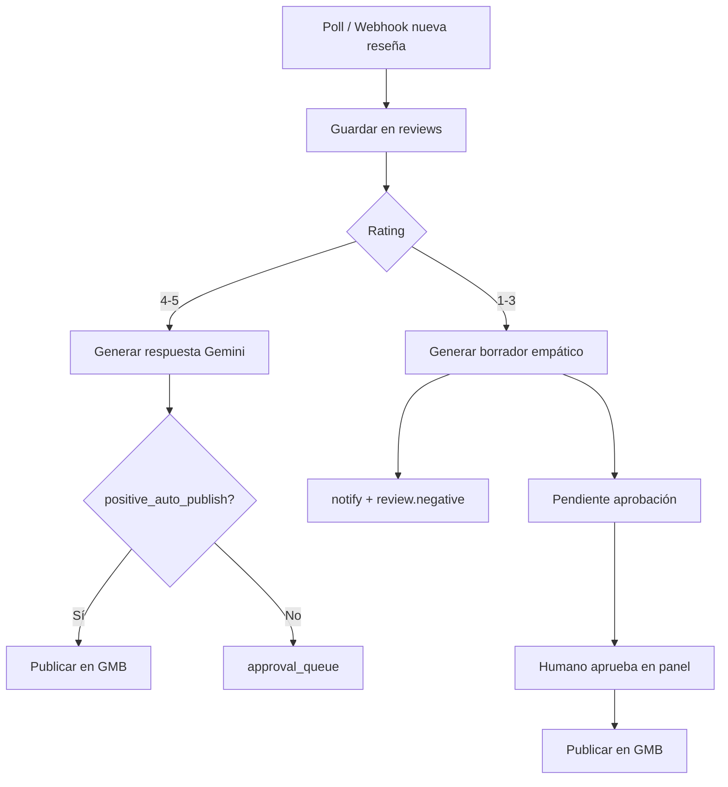

# Módulo: Reseñas GMB (`resenas-gmb`)

## Resumen y valor PYME

Monitoriza las reseñas de Google Business del negocio. Con 4–5 estrellas genera una respuesta agradecida y puede publicarla automáticamente o dejarla para aprobación. Con 1–3 estrellas genera un borrador empático, alerta al responsable y **espera aprobación humana** antes de publicar. Nunca responde una crítica sin intervención humana.

**Categoría:** social

## Requisitos funcionales

1. Sincronizar reseñas nuevas (polling o push de Google Business Profile API).
2. **Rating 4–5:** generar respuesta con IA; publicar según modo `auto` o enviar a cola de aprobación.
3. **Rating 1–3:** generar borrador; `notify` al responsable; estado `pending_approval`.
4. Publicar en Google solo tras `approved_by` + timestamp en reseñas negativas/mixtas.
5. Registrar historial de reseñas y respuestas en BD del módulo.

## Reglas de seguridad / negocio

> **NUNCA** publiques una respuesta a reseña de 1–3 estrellas sin `approved_by` y fecha de aprobación.  
> Las respuestas deben ser empáticas, sin discutir con el cliente ni ofrecer compensaciones no autorizadas.  
> No inventes hechos sobre la visita del cliente.

## Slug y dependencias

| Campo | Valor |
|-------|--------|
| Slug | `resenas-gmb` |
| Providers | `google_business`, `gemini` |
| APIs externas | [Google Business Profile API](https://developers.google.com/my-business) |

## Diagrama de flujo



## Modelo de datos sugerido

### `reviews`

| Campo | Tipo |
|-------|------|
| id | PK |
| organization_id, business_id | bigint |
| google_review_id | string unique |
| rating | tinyint |
| comment | text |
| author_name | string |
| published_at | datetime |
| status | enum: new, replied, pending_reply |

### `responses`

| Campo | Tipo |
|-------|------|
| id | PK |
| review_id | FK |
| body | text |
| generated_by_ai | bool |
| published_at | datetime nullable |
| google_reply_id | string nullable |

### `approval_queue`

| Campo | Tipo |
|-------|------|
| id | PK |
| review_id | FK |
| response_id | FK |
| status | pending, approved, rejected |
| approved_by | string nullable |
| approved_at | datetime nullable |
| rejected_reason | text nullable |

## Settings

**Globales:** `identity.trade_name`, `contact.public_email`

**`settings.modules.resenas-gmb`:**

```json
{
  "location_id": "accounts/xxx/locations/yyy",
  "positive_auto_publish": false,
  "tone": "profesional_cercano",
  "language": "es"
}
```

## Integración SDK

| Método | Uso |
|--------|-----|
| `subscriptions.check('resenas-gmb')` | Job |
| `connections.get('google_business')` | OAuth + location |
| `connections.get('gemini')` | Generar texto |
| `tokens.check` / `consume` | Por cada respuesta generada |
| `notify` | Reseña negativa nueva |
| `webhooks.emit` | `review.negative`, `review.reply.published` |

## Eventos webhook

`review.positive`, `review.negative`, `review.reply.published` — ver [eventos-webhook.md](../appendices/eventos-webhook.md).

## Fases de entrega

### MVP

- [ ] Import manual o mock de 3 reseñas (1★, 3★, 5★)
- [ ] Generación de borrador con Gemini para todas
- [ ] Bloqueo de publicación en ≤3★ sin aprobación en BD
- [ ] `notify` en reseña negativa

### Completo

- [ ] OAuth Google Business real
- [ ] Publicación API en positivas con flag auto
- [ ] Panel web de cola de aprobación
- [ ] Publicación tras aprobar

## Criterios de aceptación

- [ ] Reseña 5★: respuesta generada; sin auto-publish, queda en cola.
- [ ] Reseña 2★: no se llama a API de publicación hasta `approved_by`.
- [ ] Tokens consumidos con `reference` por reseña.
- [ ] Webhook `review.negative` al crear borrador.

## Referencias

- [provider-connections.md](../appendices/provider-connections.md)
- Patrón worker: [web-uptime](web-uptime.md)
