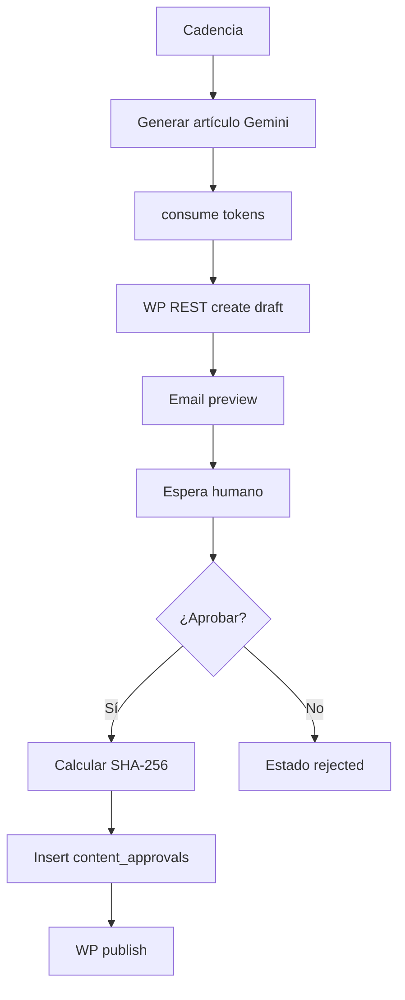

# Módulo: SEO Pipeline con aprobación (`seo-pipeline`)

## Resumen y valor PYME

Genera artículos SEO de forma programada (diaria, semanal, quincenal) y los guarda como **borradores** en WordPress. Envía email al responsable con enlace de preview. Solo publica tras aprobación explícita, registrando usuario, fecha, IP y hash SHA-256 del contenido aprobado. **Nunca** publica automáticamente.

**Categoría:** contenido

## Incluye (catálogo unificado)

Esta app sustituye en el catálogo el módulo retirado **`seo-onpage`**: metadatos on-page (título, descripción, estructura) forman parte del flujo de generación y revisión antes de publicar en WordPress.

## Requisitos funcionales

1. Scheduler según cadencia configurada.
2. Generar artículo completo (título, cuerpo, meta) con IA.
3. Crear post en WordPress vía REST API con estado `draft` únicamente.
4. Enviar email con enlace de preview (Matriz `notify` o SMTP del módulo).
5. Flujo de aprobación en panel del módulo.
6. Tras aprobar: publicar en WP y guardar auditoría.

## Reglas de seguridad / negocio

> **NUNCA** llames al endpoint de WordPress con `status: publish` sin registro en `content_approvals` con `approved_at` no nulo.  
> El hash debe calcularse sobre el HTML/markdown **exacto** publicado.  
> Si el contenido cambia tras la preview, invalidar aprobación y pedir re-aprobar.

## Slug y dependencias

| Campo | Valor |
|-------|--------|
| Slug | `seo-pipeline` |
| Providers | `wordpress`, `gemini`, `email` |
| Componentes | Scheduler + API panel aprobación + BD |

## Diagrama de flujo



## Modelo de datos sugerido

### `articles`

| Campo | Tipo |
|-------|------|
| id | PK |
| organization_id, business_id | bigint |
| wp_post_id | int |
| title | string |
| content_markdown | text |
| status | draft_pending, approved, published, rejected |
| preview_url | string |
| scheduled_for | date |

### `content_approvals`

| Campo | Tipo |
|-------|------|
| id | PK |
| article_id | FK |
| approved_by | string |
| approved_at | datetime |
| approver_ip | string |
| content_hash_sha256 | char(64) |
| wp_revision | string nullable |

## Settings

**Globales:** `web.url`, `web.language`, `identity.trade_name`

**`settings.modules.seo-pipeline`:**

```json
{
  "cadence": "weekly",
  "day_of_week": 1,
  "topics": ["mantenimiento", "servicios locales"],
  "min_words": 800,
  "wp_category_id": 5,
  "approver_emails": ["dueno@negocio.com"]
}
```

`cadence`: `daily` | `weekly` | `biweekly`

## Integración SDK

| Método | Uso |
|--------|-----|
| `subscriptions.check('seo-pipeline')` | Scheduler |
| `connections.get('wordpress')` | `site_url`, application password |
| `connections.get('gemini')` | Redacción |
| `tokens.check(2000)` / `consume` | Alto consumo; ajustar por artículo real |
| `notify` | «Borrador listo para revisar» |
| `webhooks.emit` | `article.draft_ready`, `article.published` |

## Cálculo del hash

```typescript
import { createHash } from 'crypto';
const hash = createHash('sha256').update(contentExacto, 'utf8').digest('hex');
```

Guardar `contentExacto` en BD al momento de aprobar.

## WordPress REST (borrador)

```
POST /wp-json/wp/v2/posts
{ "title": "...", "content": "...", "status": "draft" }
```

Publicar solo después de aprobación:

```
POST /wp-json/wp/v2/posts/{id}
{ "status": "publish" }
```

## Fases de entrega

### MVP

- [ ] Generar artículo mock sin WP
- [ ] Tabla `content_approvals` con hash
- [ ] Panel: listar pendientes + botón aprobar
- [ ] Sin publish hasta aprobar (simular WP con flag local)

### Completo

- [ ] WP draft real
- [ ] Email con preview URL
- [ ] Cadencias daily/weekly/biweekly
- [ ] Webhook al publicar

## Criterios de aceptación

- [ ] Sin fila en `content_approvals`, el post no pasa a `published`.
- [ ] Tras aprobar, hash coincide al republicar el mismo contenido.
- [ ] Cambio de una palabra en contenido → hash distinto, bloqueo de publish directo.
- [ ] `tokens.consume` con `reference: article-{id}`.

## Referencias

- [provider-connections.md](../appendices/provider-connections.md) — WordPress
- [checklist-entrega.md](../appendices/checklist-entrega.md)
