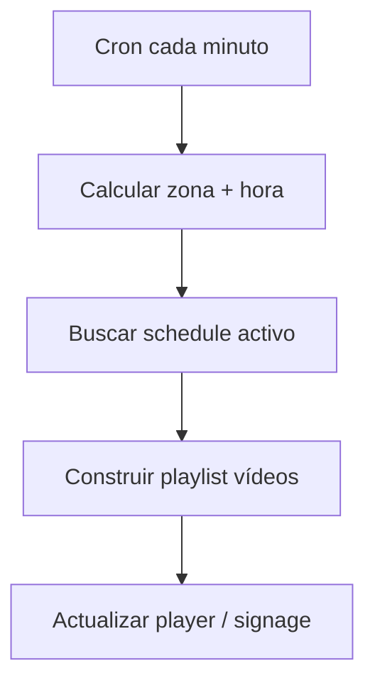

# Módulo: Video en local (`video-local`)

## Resumen y valor PYME

Reproduce en las pantallas del local vídeos formativos o promocionales: rutinas en un gimnasio, tutoriales de máquinas, tratamientos en clínica, demos en tienda. El contenido se programa por **horario** o **zona** del local desde el panel.

**Categoría:** visual

## Requisitos funcionales

1. Biblioteca de vídeos (URL CDN o archivo subido al módulo).
2. Zonas del local (`zone`: sala1, recepción, etc.).
3. Franjas horarias (`time_slot`: día + hora inicio/fin).
4. Asignar lista de vídeos por zona + franja.
5. Reproducción en player (propio o vía [digital-signage](digital-signage.md) playlist `video_feed`).

## Reglas de seguridad / negocio

> Vídeos pesados: servir por CDN o streaming; no pasar binarios por la API de La Matriz.  
> Derechos de autor: el panel debe registrar que el negocio tiene derecho de exhibición.  
> Contenido sensible: flag `staff_only` para no mostrar en zonas públicas.

## Slug y dependencias

| Campo | Valor |
|-------|--------|
| Slug | `video-local` |
| Integración | [digital-signage](digital-signage.md) recomendada |
| Providers | opcional almacenamiento S3 (credenciales en módulo o futuro provider `s3`) |

## Diagrama de flujo



## Modelo de datos sugerido

### `videos`

| Campo | Tipo |
|-------|------|
| id | PK |
| business_id | bigint |
| title | string |
| url | string |
| duration_seconds | int |
| tags | json |
| staff_only | bool |

### `zones`

| Campo | Tipo |
|-------|------|
| id | PK |
| business_id | bigint |
| name | string |
| signage_screen_id | FK nullable |

### `video_schedules`

| Campo | Tipo |
|-------|------|
| id | PK |
| zone_id | FK |
| day_of_week | 0-6 |
| start_time | time |
| end_time | time |
| video_ids | json ordered array |
| priority | int |

## Settings

**`settings.modules.video-local`:**

```json
{
  "timezone": "Europe/Madrid",
  "default_loop": true,
  "gap_between_videos_seconds": 2
}
```

## Integración SDK

| Método | Uso |
|--------|-----|
| `subscriptions.check('video-local')` | Scheduler |
| `auth.check()` | business context |
| `webhooks.emit` | Opcional al cambiar programación |

## Player

**Opción A:** Player dedicado `/play/zone/{zoneToken}` (loop HTML5 video).  
**Opción B:** Empujar lista a digital-signage como slides `kind: video`.

## Fases de entrega

### MVP

- [ ] 3 vídeos YouTube/CDN de prueba
- [ ] 1 zona, 1 franja horaria
- [ ] Player muestra lista correcta en horario activo

### Completo

- [ ] Multi-zona multi-franja con prioridades
- [ ] Integración signage SSE
- [ ] Subida de vídeo al módulo con transcodificación opcional

## Criterios de aceptación

- [ ] Fuera de franja horaria → playlist vacía o vídeo «cerrado».
- [ ] Cambiar `video_ids` en panel → player actualiza en siguiente minuto o por SSE.
- [ ] `staff_only` no se muestra en zona pública.

## Referencias

- [digital-signage](digital-signage.md)
- [02-anatomia-de-un-modulo](../02-anatomia-de-un-modulo.md)
