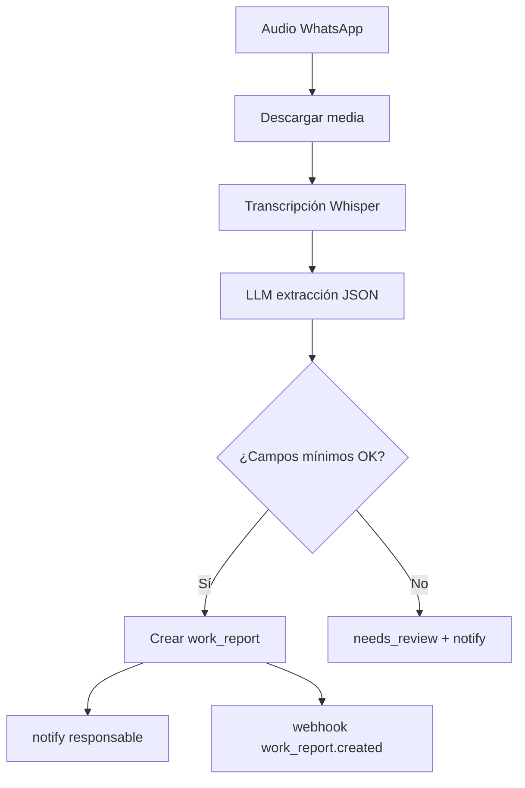

# Módulo: Voz a gestión (`voz-gestion`)

## Resumen y valor PYME

El trabajador de campo termina un trabajo y envía un **audio por WhatsApp** en lugar de un parte en papel. El módulo transcribe el audio (Whisper), extrae datos estructurados (cliente, dirección, trabajo, materiales, horas, observaciones) y crea el parte de trabajo. El responsable lo ve en el panel sin intervención manual de digitación.

**Categoría:** gestión

## Requisitos funcionales

1. Recibir mensaje de audio por WhatsApp (webhook Meta).
2. Descargar archivo de audio de la API de Meta.
3. Transcribir con **Whisper** (OpenAI o proveedor acordado).
4. Extraer campos estructurados con LLM (JSON schema estricto).
5. Persistir `work_report` y notificar al responsable.
6. Panel: listado de partes pendientes / validados.

## Reglas de seguridad / negocio

> No almacenes audios más tiempo del necesario (RGPD: política de retención documentada, p. ej. 30 días).  
> Si la transcripción es ambigua, marcar parte como `needs_review` en lugar de inventar datos.  
> Los audios pueden contener datos personales: restringe acceso al panel por `business_id`.

## Slug y dependencias

| Campo | Valor |
|-------|--------|
| Slug | `voz-gestion` |
| Providers | `meta_whatsapp`, `gemini` u `openai` (Whisper) |
| Componentes | API webhook + BD + panel |

## Diagrama de flujo



## Modelo de datos sugerido

### `work_reports`

| Campo | Tipo |
|-------|------|
| id | PK |
| organization_id, business_id | bigint |
| technician_phone | string |
| client_name | string |
| client_address | text |
| work_description | text |
| materials | json array |
| hours_spent | decimal |
| notes | text |
| transcript_raw | text |
| status | enum: pending, validated, needs_review |
| audio_url | string nullable |
| created_at | datetime |

## JSON schema de extracción (ejemplo)

```json
{
  "client_name": "string",
  "client_address": "string",
  "work_description": "string",
  "materials": ["string"],
  "hours_spent": 0,
  "notes": "string",
  "confidence": 0.0
}
```

Rechaza guardar si `confidence < 0.6` o falta `client_name` + `work_description`.

## Settings

**`settings.modules.voz-gestion`:**

```json
{
  "notify_email": "encargado@negocio.com",
  "retention_days_audio": 30,
  "default_technician_roles": ["field"]
}
```

## Integración SDK

| Método | Uso |
|--------|-----|
| `subscriptions.check('voz-gestion')` | Por audio |
| `connections.get('meta_whatsapp')` | Media |
| `connections.get('openai')` o whisper vía OpenAI | Transcripción |
| `connections.get('gemini')` | Extracción estructurada |
| `tokens.consume` | Transcripción + extracción (sumar estimación) |
| `notify` | Nuevo parte |
| `webhooks.emit('work_report.created')` | |
| `leads.event` | Opcional si vinculas a lead existente |

## Fases de entrega

### MVP

- [ ] Endpoint que acepta audio de prueba (archivo local)
- [ ] Transcripción + JSON extraído
- [ ] Fila en `work_reports` + notify

### Completo

- [ ] WhatsApp real
- [ ] Panel listado y botón «validar»
- [ ] Borrado programado de audios

## Criterios de aceptación

- [ ] Audio de prueba 30 s → parte con al menos 4 campos rellenos.
- [ ] Audio ininteligible → `needs_review`, sin datos inventados.
- [ ] `tokens.consume` con `module: 'voz-gestion'` y reference único.
- [ ] Dos negocios no ven partes del otro.

## Referencias

- [whatsapp-guardia](whatsapp-guardia.md) — mismo webhook Meta
- [provider-connections.md](../appendices/provider-connections.md)
