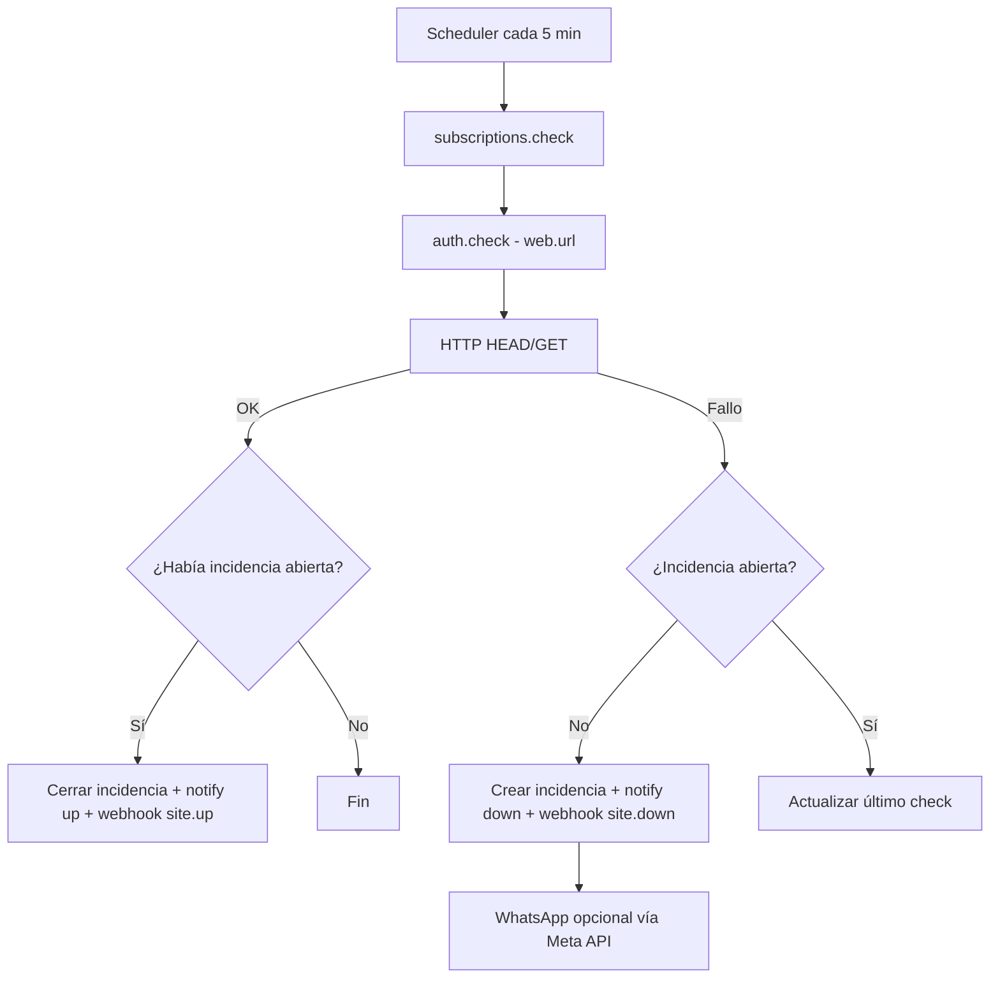

# Módulo: Monitor web y SSL (`web-uptime`)

## Resumen y valor PYME

Comprueba cada pocos minutos que la web del negocio responde y revisa el certificado SSL de la URL configurada. Si la web cae, avisa al responsable por email con la hora exacta del fallo; si el SSL caduca en menos de 30 días o ya ha caducado, envía aviso preventivo. Cuando la web se recupera, notifica la duración total de la indisponibilidad. Mantiene historial de incidencias y estado SSL en el panel (`ssl_expires_at`, `ssl_days_remaining`, `ssl_ok` vía `matrix.runtime.publish`).

## Incluye (catálogo unificado)

Sustituye en el catálogo el módulo retirado **`monitor-ssl`**. No crear slug `monitor-ssl`; toda la lógica SSL vive bajo `web-uptime`.

**Categoría:** monitorización  
**Referencia implementada:** [`apps/module-web-uptime`](../../../apps/module-web-uptime)

## Requisitos funcionales

1. Ping periódico (cada **5 minutos**) a la URL configurada del negocio.
2. Si la web no responde correctamente (timeout, 5xx, conexión rechazada): alerta inmediata.
3. Canales de alerta: **email** y **WhatsApp** al responsable.
4. Al recuperarse: segunda notificación con **duración total** de la caída.
5. Historial de incidencias (inicio, fin, duración, código HTTP) en BD del módulo.
6. Comprobar caducidad del certificado SSL de `settings.web.url` (HTTPS).
7. Alertas si el SSL caduca en menos de 30 días o ya está caducado.
8. Publicar en runtime: `ssl_expires_at`, `ssl_days_remaining`, `ssl_ok`.

## Reglas de seguridad / negocio

> No marques la web como caída por un único fallo transitorio sin confirmación opcional (recomendado: 2 fallos consecutivos de 5 min).  
> No incluyas en alertas datos personales de clientes; solo URL, hora y estado HTTP.

## Slug y dependencias

| Campo | Valor |
|-------|--------|
| Slug | `web-uptime` |
| Providers | `email`, `meta_whatsapp` (alertas) |
| Guías previas | [03-contrato-matriz](../03-contrato-matriz.md), [04-settings](../04-settings-y-config.md) |

## Diagrama de flujo



## Modelo de datos sugerido

### `incidents`

| Campo | Tipo | Notas |
|-------|------|-------|
| id | PK | |
| organization_id | bigint | |
| business_id | bigint | |
| url | string | |
| started_at | datetime | |
| ended_at | datetime nullable | null = aún caída |
| duration_seconds | int nullable | calculado al cerrar |
| last_status_code | int | |
| last_error | string nullable | |

### `check_state` (opcional, 1 fila por negocio)

| Campo | Tipo |
|-------|------|
| business_id | PK |
| last_ok_at | datetime |
| consecutive_failures | int |
| open_incident_id | FK nullable |

## Settings

**Globales:** `settings.web.url` (prioritario) o `monitor_url` legacy.

**Módulo** (`settings.modules.web-uptime`):

```json
{
  "interval_minutes": 5,
  "confirm_failures": 2,
  "alert_whatsapp": true,
  "alert_email": true
}
```

## Integración SDK

| Método | Uso |
|--------|-----|
| `subscriptions.check('web-uptime')` | Inicio del job |
| `auth.check()` | URL del negocio |
| `notify('alert_center', …)` | Email (Matriz) |
| `webhooks.emit('site.down' \| 'site.up')` | Integraciones del cliente |
| `connections.get('meta_whatsapp')` | Enviar WhatsApp si implementas envío directo |

**Nota:** El MVP en repo solo usa `notify` para email. Extender con Meta API es parte del entregable completo.

## Eventos webhook

Ver [eventos-webhook.md](../appendices/eventos-webhook.md): `site.down`, `site.up`.

## Fases de entrega

### MVP

- [ ] Ping cada 5 min a `web.url`
- [ ] Alerta email en caída (`notify`)
- [ ] Tabla `incidents` y cierre con duración
- [ ] `webhooks.emit` en down/up

### Completo

- [ ] WhatsApp al responsable (Meta API + `meta_whatsapp`)
- [ ] Panel GET `/incidents?business_id=` (API del módulo)
- [ ] Confirmación por 2 fallos consecutivos
- [ ] UI simple de historial

## Criterios de aceptación

- [ ] Con URL demo 200 (`httpstat.us/200`): sin alerta, check OK en logs.
- [ ] Con URL 503: se abre incidencia, email en Mailpit, webhook disparado.
- [ ] Tras volver a 200: incidencia cerrada, `site.up` con `durationSeconds`.
- [ ] Dos negocios demo no comparten incidencias.

## Arranque (referencia)

```bash
cd apps/module-web-uptime
cp .env.example .env
# MODULE_API_KEY=bm_...
pnpm install
pnpm check    # una vez
pnpm start    # cada 5 min
```

## Referencias

- [module-guide.md](../../module-guide.md) — resumen
- [e2e-validation.md](../../../scripts/e2e-validation.md) — prueba con Karting Alicante (503)
