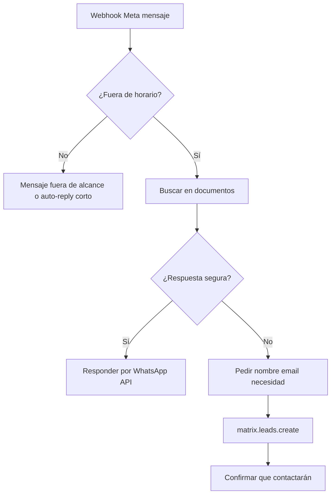

# Módulo: WhatsApp Guardia (`whatsapp-guardia`)

## Resumen y valor PYME

Fuera del horario laboral configurado, atiende mensajes de WhatsApp del negocio usando documentos subidos (PDF de servicios, FAQ, precios orientativos). Si no puede resolver la consulta, recoge nombre, email y necesidad y crea un **lead** para el día siguiente. Nunca hace reservas, no da precios cerrados ni promete descuentos.

**Categoría:** social

## Requisitos funcionales

1. Recibir mensajes entrantes vía webhook de **WhatsApp Cloud API** (Meta).
2. Determinar si la hora actual está **fuera** del horario laboral (`schedule` + `timezone`).
3. Dentro de guardia: responder con RAG sobre documentos del negocio.
4. Si no hay respuesta fiable: solicitar nombre, email, necesidad → `matrix.leads.create`.
5. Dentro de horario laboral: opcionalmente no responder o mensaje «escribimos mañana en horario».

## Reglas de seguridad / negocio

> El system prompt debe incluir de forma explícita:  
> **Prohibido:** confirmar reservas, dar precios finales/cerrados, prometer descuentos, comprometer plazos legales.  
> Ante duda, escalar a lead humano.  
> No enviar datos de otros clientes.

## Slug y dependencias

| Campo | Valor |
|-------|--------|
| Slug | `whatsapp-guardia` |
| Providers | `meta_whatsapp`, `gemini` |
| Componentes | API propia (webhook) + BD documentos + opcional vector store |

## Diagrama de flujo



## Modelo de datos sugerido

### `documents`

| Campo | Tipo |
|-------|------|
| id | PK |
| organization_id, business_id | bigint |
| filename | string |
| storage_path | string |
| mime_type | string |
| uploaded_at | datetime |
| chunk_count | int nullable |

### `document_chunks` (RAG)

| Campo | Tipo |
|-------|------|
| id | PK |
| document_id | FK |
| content | text |
| embedding | blob/json nullable |

### `conversations`

| Campo | Tipo |
|-------|------|
| id | PK |
| wa_phone | string |
| state | enum: chatting, collecting_lead, closed |
| lead_id | bigint nullable |

## Settings

**`settings.modules.whatsapp-guardia`:**

```json
{
  "timezone": "Europe/Madrid",
  "schedule": {
    "mon": { "open": "09:00", "close": "18:00" },
    "sat": null,
    "sun": null
  },
  "welcome_message": "Hola, estamos fuera de horario. ¿En qué podemos ayudarte?",
  "escalation_after_messages": 3
}
```

## Integración SDK

| Método | Uso |
|--------|-----|
| `subscriptions.check('whatsapp-guardia')` | Por mensaje o health job |
| `connections.get('meta_whatsapp')` | Enviar/recibir |
| `connections.get('gemini')` | RAG + clasificación |
| `tokens.check` / `consume` | Por turno de conversación |
| `leads.create` | Escalado |
| `webhooks.emit('whatsapp.escalated')` | Opcional |

## System prompt (fragmento obligatorio)

```
Eres el asistente fuera de horario de {trade_name}.
Solo respondes con información de los documentos proporcionados.
NO hagas reservas, NO des precios cerrados, NO prometas descuentos.
Si no sabes la respuesta, pide nombre, email y resumen de la consulta.
```

## Fases de entrega

### MVP

- [ ] Webhook simulado con POST local + horario mock
- [ ] 1 PDF indexado (texto plano extraído)
- [ ] Respuesta Gemini con citas limitadas al contexto
- [ ] Lead creado en Matriz al escalar

### Completo

- [ ] Meta webhook verificado en producción
- [ ] Panel subida de PDFs
- [ ] Embeddings y búsqueda semántica
- [ ] Conversación multi-turno con estado

## Criterios de aceptación

- [ ] Mensaje fuera de horario con FAQ en PDF → respuesta coherente.
- [ ] Pregunta fuera de documentos → flujo lead + campos obligatorios.
- [ ] Pregunta «¿cuánto cuesta X?» → respuesta orientativa o escalado, sin precio cerrado.
- [ ] Lead visible en Dashboard → Leads con `source: whatsapp-guardia`.

## Referencias

- [03-contrato-matriz](../03-contrato-matriz.md) — leads
- [provider-connections.md](../appendices/provider-connections.md) — Meta
